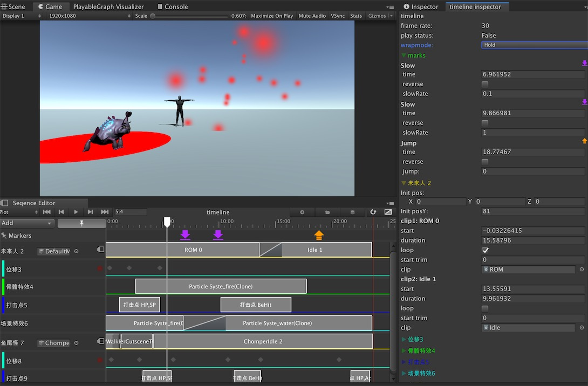

## Seqence

__剧情-技能编辑器__

## 序列化方式

支持xml和bytes两种序列化方式， xml兼容性和可读性更高，比较项目前期，改动比较频繁的情况。 bytes运行时效率更高。 这里并不采用unity原生timeline的scriptobject序列化方式， 主要原因是效率和服务器不可读。

## 多线程支持

支持unity 安全多线程的AniationJob， 这一特性在Unity2019.3之后的版本才加入，之前一直是实验版本。

## Server

服务器使用c++开发， 为了对技能同步表现一致， 使用了基于著名的开源框架Entitas的ECS架构。 初步设想是编译成跨平台的库集成到Plugin中， 用以之后虚拟服务器的使用， 后续持续集成中。

[i1]: https://github.com/huailiang/seqence
